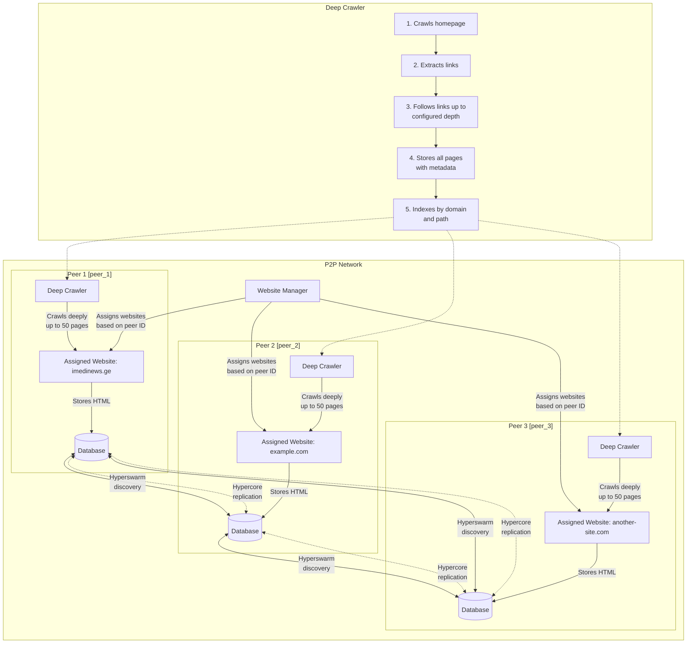
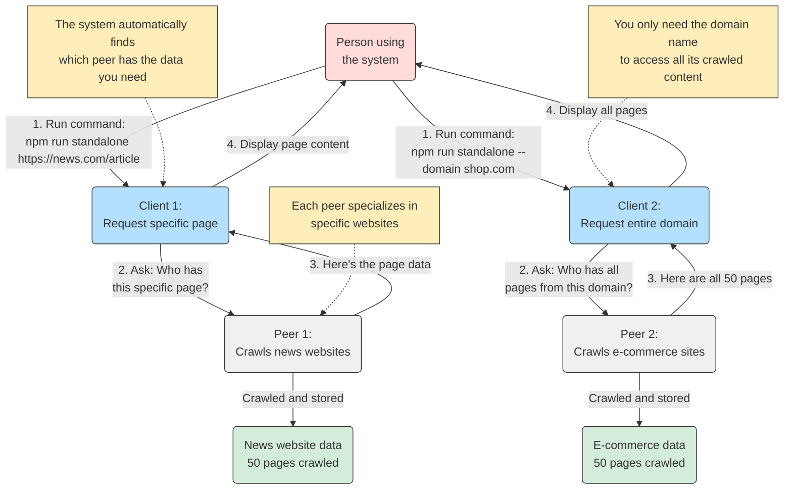
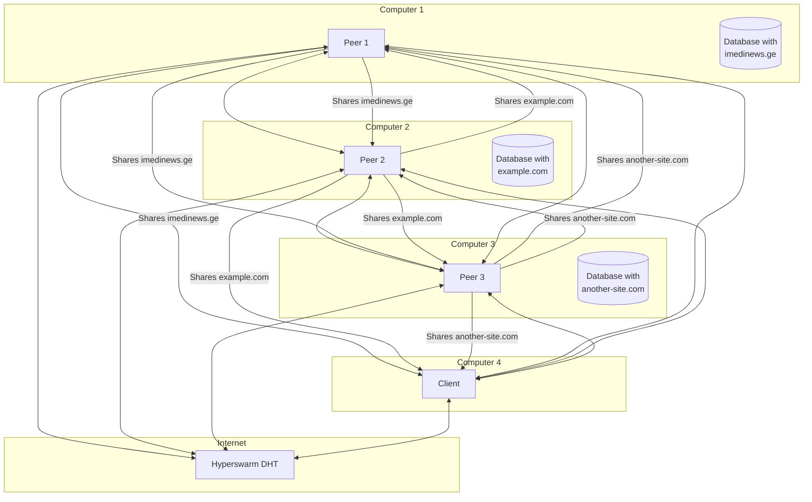
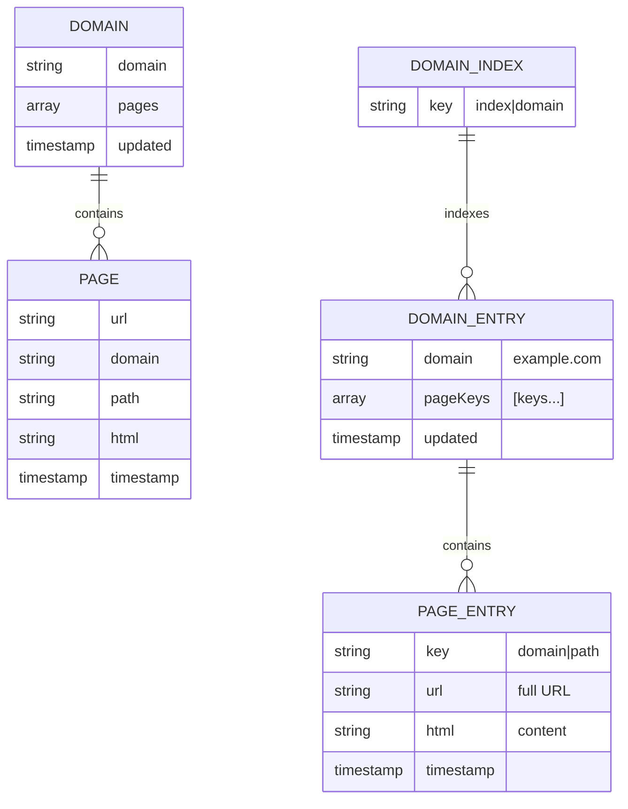
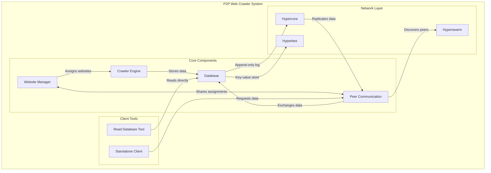

# P2P Web Crawler Diagrams

## How It Works

```mermaid
graph TB
    subgraph "P2P Network"
        subgraph "Peer 1 [peer_1]"
            P1W[Assigned Website: imedinews.ge]
            P1DB[(Database)]
            P1C[Deep Crawler]

            P1C -->|Crawls deeply<br>up to 50 pages| P1W
            P1W -->|Stores HTML| P1DB
        end

        subgraph "Peer 2 [peer_2]"
            P2W[Assigned Website: example.com]
            P2DB[(Database)]
            P2C[Deep Crawler]

            P2C -->|Crawls deeply<br>up to 50 pages| P2W
            P2W -->|Stores HTML| P2DB
        end

        subgraph "Peer 3 [peer_3]"
            P3W[Assigned Website: another-site.com]
            P3DB[(Database)]
            P3C[Deep Crawler]

            P3C -->|Crawls deeply<br>up to 50 pages| P3W
            P3W -->|Stores HTML| P3DB
        end

        %% Connect the peers - fixed to connect specific components
        P1DB <-->|Hyperswarm<br>discovery| P2DB
        P2DB <-->|Hyperswarm<br>discovery| P3DB
        P3DB <-->|Hyperswarm<br>discovery| P1DB

        %% Replicate databases
        P1DB <-.->|Hypercore<br>replication| P2DB
        P2DB <-.->|Hypercore<br>replication| P3DB
        P3DB <-.->|Hypercore<br>replication| P1DB

        %% Website Manager
        WM[Website Manager]
        WM -->|Assigns websites<br>based on peer ID| P1W
        WM -->|Assigns websites<br>based on peer ID| P2W
        WM -->|Assigns websites<br>based on peer ID| P3W
    end

    %% Deep Crawler Details connected properly
    subgraph "Deep Crawler"
        DC1[1. Crawls homepage]
        DC2[2. Extracts links]
        DC3[3. Follows links up to<br>configured depth]
        DC4[4. Stores all pages<br>with metadata]
        DC5[5. Indexes by domain<br>and path]

        DC1 --> DC2 --> DC3 --> DC4 --> DC5
    end

    %% Connect crawler details to actual crawlers
    DC5 -.-> P1C
    DC5 -.-> P2C
    DC5 -.-> P3C
```

## Example Usage Scenarios

```mermaid
flowchart TD
    %% Node styles
    classDef userStyle fill:#ffdbd9,stroke:#333,stroke-width:1px,color:#333
    classDef clientStyle fill:#b3e0ff,stroke:#333,stroke-width:1px,color:#333
    classDef peerStyle fill:#f0f0f0,stroke:#333,stroke-width:1px,color:#333
    classDef dataStyle fill:#d4edda,stroke:#333,stroke-width:1px,color:#333
    classDef noteStyle fill:#ffeeba,stroke:#333,stroke-width:1px,color:#333

    %% Define nodes
    User("Person using<br>the system")
    Client1("Client 1:<br>Request specific page")
    Client2("Client 2:<br>Request entire domain")
    Peer1("Peer 1:<br>Crawls news websites")
    Peer2("Peer 2:<br>Crawls e-commerce sites")
    News("News website data<br>50 pages crawled")
    Ecommerce("E-commerce data<br>50 pages crawled")

    %% Scenario 1
    User -->|"1. Run command:<br>npm run standalone https://news.com/article"| Client1
    Client1 -->|"2. Ask: Who has<br>this specific page?"| Peer1
    Peer1 -->|"3. Here's the page data"| Client1
    Client1 -->|"4. Display page content"| User

    %% Scenario 2
    User -->|"1. Run command:<br>npm run standalone --domain shop.com"| Client2
    Client2 -->|"2. Ask: Who has all<br>pages from this domain?"| Peer2
    Peer2 -->|"3. Here are all 50 pages"| Client2
    Client2 -->|"4. Display all pages"| User

    %% Data connections
    Peer1 -->|"Crawled and stored"| News
    Peer2 -->|"Crawled and stored"| Ecommerce

    %% Helpful notes
    Note1["You only need the domain name<br>to access all its crawled content"]
    Note2["The system automatically finds<br>which peer has the data you need"]
    Note3["Each peer specializes in<br>specific websites"]

    %% Connect notes
    Note1 -.-> Client2
    Note2 -.-> Client1
    Note3 -.-> Peer1

    %% Apply styles
    User:::userStyle
    Client1:::clientStyle
    Client2:::clientStyle
    Peer1:::peerStyle
    Peer2:::peerStyle
    News:::dataStyle
    Ecommerce:::dataStyle
    Note1:::noteStyle
    Note2:::noteStyle
    Note3:::noteStyle
```

## Network Topology

```mermaid
flowchart TB
    subgraph "Internet"
        H1[Hyperswarm DHT]
    end

    subgraph "Computer 1"
        P1[Peer 1]
        P1DB[(Database with<br>imedinews.ge)]
    end

    subgraph "Computer 2"
        P2[Peer 2]
        P2DB[(Database with<br>example.com)]
    end

    subgraph "Computer 3"
        P3[Peer 3]
        P3DB[(Database with<br>another-site.com)]
    end

    subgraph "Computer 4"
        C1[Client]
    end

    %% Connect peers to DHT
    P1 <--> H1
    P2 <--> H1
    P3 <--> H1
    C1 <--> H1

    %% Direct peer connections after discovery
    P1 <--> P2
    P2 <--> P3
    P3 <--> P1
    C1 <--> P1
    C1 <--> P2
    C1 <--> P3

    %% Data flow
    P1 -->|Shares imedinews.ge| P2
    P1 -->|Shares imedinews.ge| P3
    P1 -->|Shares imedinews.ge| C1

    P2 -->|Shares example.com| P1
    P2 -->|Shares example.com| P3
    P2 -->|Shares example.com| C1

    P3 -->|Shares another-site.com| P1
    P3 -->|Shares another-site.com| P2
    P3 -->|Shares another-site.com| C1
```

## Database Organization

```mermaid
erDiagram
    DOMAIN ||--o{ PAGE : contains
    DOMAIN {
        string domain
        array pages
        timestamp updated
    }
    PAGE {
        string url
        string domain
        string path
        string html
        timestamp timestamp
    }

    %% Example structure
    DOMAIN_INDEX ||--o{ DOMAIN_ENTRY : indexes
    DOMAIN_ENTRY ||--o{ PAGE_ENTRY : contains

    DOMAIN_INDEX {
        string key "index|domain"
    }
    DOMAIN_ENTRY {
        string domain "example.com"
        array pageKeys "[keys...]"
        timestamp updated
    }
    PAGE_ENTRY {
        string key "domain|path"
        string url "full URL"
        string html "content"
        timestamp timestamp
    }
```

## Component Diagram

```mermaid
graph TD
    subgraph "P2P Web Crawler System"
        subgraph "Core Components"
            WM[Website Manager]
            C[Crawler Engine]
            P[Peer Communication]
            DB[Database]

            WM -->|Assigns websites| C
            C -->|Stores data| DB
            P -->|Exchanges data| DB
            WM <-->|Shares assignments| P
        end

        subgraph "Client Tools"
            SC[Standalone Client]
            RDB[Read Database Tool]

            SC -->|Requests data| P
            RDB -->|Reads directly| DB
        end

        subgraph "Network Layer"
            HS[Hyperswarm]
            HC[Hypercore]
            HB[Hyperbee]

            P -->|Discovers peers| HS
            DB -->|Append-only log| HC
            DB -->|Key-value store| HB
            HC -->|Replicates data| P
        end
    end
```
